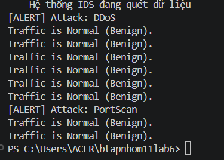
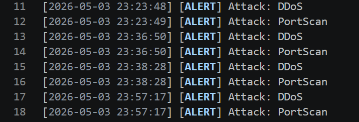

## Network Intrusion Detection System (Lab 6)

### 1. Cách cài đặt & Chạy giả lập

- **Cài đặt thư viện:** `pip install -r nam/requirements.txt`
- **Chạy hệ thống IDS:** `python ids_simulation.py`

### 2. Hệ thống cảnh báo & Log

- **Cảnh báo Console:** Khi phát hiện tấn công, hệ thống in dòng `[ALERT] Attack: [Loại tấn công]`.
  
- **File Log:** Tất cả cảnh báo được lưu tự động vào file `alerts.log` kèm mốc thời gian để quản trị viên theo dõi.
  

### 3. Bảng so sánh kết quả các Model

Nhóm đã thử nghiệm 5 thuật toán và chọn ra **Random Forest** làm mô hình triển khai thực tế.

| Model                   |  Accuracy  | Precision  |   Recall   |  F1-Score  |
| :---------------------- | :--------: | :--------: | :--------: | :--------: |
| **Random Forest**       | **0.9527** | **0.8888** | **0.9319** | **0.8797** |
| **KNN**                 |   0.9335   |   0.8589   |   0.8965   |   0.8489   |
| **Logistic Regression** |   0.7935   |   0.7590   |   0.8118   |   0.7221   |
| **SVM**                 |   0.7445   |   0.7176   |   0.7771   |   0.6651   |
| **Naive Bayes**         |   0.6687   |   0.6646   |   0.6457   |   0.5864   |

> **Lý do chọn Random Forest:** Có chỉ số **Recall (93.19%)** cao nhất, giúp phát hiện gần như chính xác các cuộc tấn công mạng, giảm thiểu rủi ro bỏ sót mã độc.
